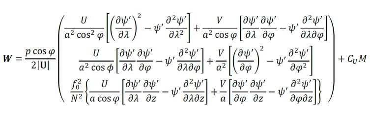
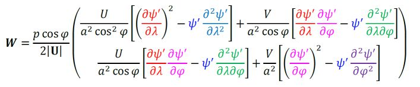
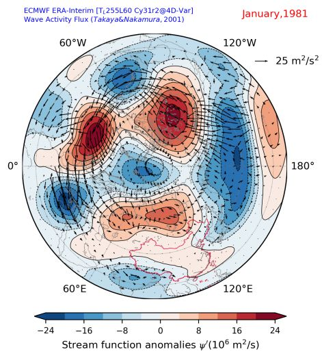
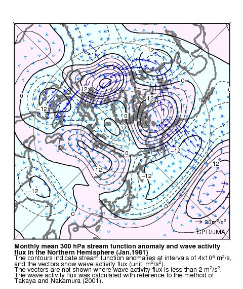

# T-N Wave-Activity Flux

Caculating the `T-N Wave-Activity Flux` derived by `Takaya and Nakamura (JAS,2001)`.

All computations are based on `numpy` arrays, which are very efficient.
Partial differential terms in the formula are calculated by `numpy.gradient` in the central difference method.

## Introduction 

Takaya and Nakamura generalize the Plumb Wave-Activity Flux(Plumb,1985) so as to be applicable to small-amplitude Quasi-Geostrophic(QG) disturbances, either stationary or migratory, that are superimposed on a zonally varying basic flow, and introduced the `T-N Wave-Activity Flux` ('TN01' for short).

TN01 is of great advantage in climate monitoring and diagnosis.

> TN01 with improved meridional component based on Plumb Wave-Activity Flux is appropriate for analyzing Rossby waves in the zonally asymmetric westerly. And it reflect the evolution of long-waves which the E-P Flux can't. 
> (Shi Chunhua,2017)

## Getting Started

### Prerequisites

* Python 3
* numpy

### Installation 

by pip:

```sh
pip install tnflux
```

### Usage

```py
import tnflux
...
px, py = tnflux.tnf2d(u_c, v_c, phi_c, phi, lat, lon, p_lev) 
```

### Data & Process

**tnf2d**

Horizontal TN01 caltulation

Parameters

- `u_c` : array_like.  
    climate average background of meridional wind.

- `v_c` : array_like.  
    climate average background of zonal wind.

- `phi_c` : array_like.  
    climate average background of geopotential.

- `phi` : array_like.  
    geopotential in the analysis period.

- `lat` : array_like.  
    latitude.
    
- `lon` : array_like.  
    longitude.

- `p_lev` : float.  
    level.  
    unit: hPa.

Return

- `px` for longitude direction
- `py` for latitude direction

Note

Geopotential anomalies will be used to compute pertubation stream-function `psi_p` in Quasi-Geostrophic(QG) assumption:

* `psi_p` = (`phi` - `phi_c`) / `f`  
`f` is the Coriolis parameter: `f` = 2 \* omega \* sin(`lat`)

*Input Data is Geopotential, NOT Geopotential Height!!!*  
The re-analysis from NCEP/NCAR(NCEP1) is Geopotential Height, Geopotential Height multiplied by gravity `g` makes Geopotential.

## Formulation

These Python scripts use the TN01 diagnostic formula in Spherical coordinates, which is the Eq.38 of Takaya's paper published in 2001:



The first two terms in Eq.38 are taken into account while computing on the horizontal direction.
And assuming the wave is stationary, so the Cu in Eq.38 would be zero.
So the formula of horizontal T-N Wave-Activity Flux could yield as followed:



## Reliability

The output figures sample(Datas from `ECMWF ERA-Interim`)



Results are compatible with the Wave-Activity Flux figures(JRA-55) made by JMA-TCC.  
(http://ds.data.jma.go.jp/tcc/tcc/products/clisys/figures/db_hist_pen_tcc.html)



and also the programs by Kazuaki Nishii @ University of Tokyo.  
(http://www.atmos.rcast.u-tokyo.ac.jp/nishii/programs/index.html)

## Authors

Lai Sheng: laish12@lzu.edu.cn .
You can also visit his site for more detail: http://500hpa.cn/pyinmet/tnflux/

Yongpeng Zhang: zhangyp6603@outlook.com
